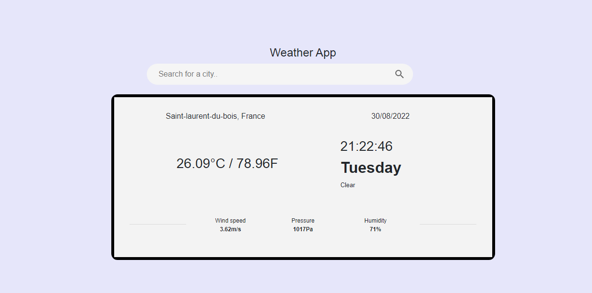
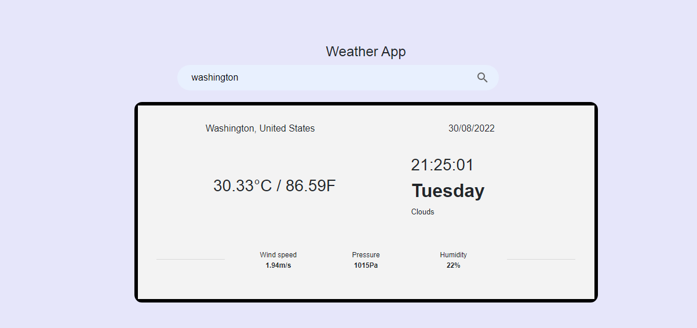

# Weather App ⛅

This is a practice repository for open source beginners. 
You can create Issues and PRs for practice.

## About the App

- This is a weather app made using Django. It displays temperature, and more information (such as humidity, wind speed, atmospheric pressure, etc) of a searched city.

## Getting started

- Follow this [link](https://www.w3schools.com/django/django_getstarted.php) to read on how to install Django.
- Follow this [link](https://www.dataschool.io/how-to-contribute-on-github/) if you are new to opensource and want to know how to create Issues and PRs.
- Follow this [link](https://openweathermap.org/) to read on how to generate your api key.


## Guidelines on how to run locally 💻
### Clone this repository

```
git clone https://github.com/zadilkhwaja/Weather_App_Django.git
```

### Change directory
Change your directory to where you cloned the repository

```
cd Weather_App_Django
```

### Create a virtual environment in the Weather_App directory
Ensure you are in the Weather_App_Django directory, run this command to create a virtual environment:
```
python -m venv .\venv
```
### Activate the virtual environment
Activate the virtual environment using the following command: 
```
venv\scripts\activate
```

### Change directory to weather, and run the project

```
cd weather
python manage.py runserver
```
### Navigate to ```http://127.0.0.1:8000/``` to view the project.

### Screenshots


By default when you access the web app, it displays the information of a random city.


Then, when you decide to search for any city of your choice, the information is displayed to you.
<hr>

#### This project is just for practice and is in initial stages feel free to ask any questions or add something if i missed out, by raising an issue [here.](https://github.com/zadilkhwaja/Weather_App_Django/issues) If you love this project, kindly give it a star ⭐ and share it with others 🤗.

Note: This web app is not deployed yet.